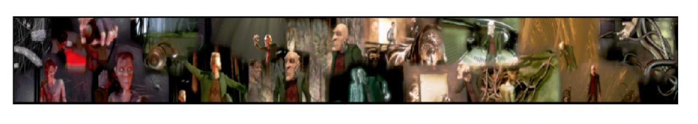

# Multimedia_Synopsis
The project is a media synoposis algorithm that produces a “synopsis image” summarizing media content. 

Synopsis is an ancient Greek word that means “general view” or a “summary view”. As input you will take a path to a folder that contains various visual media elements – video (with audio) and images. Normally all these media elements at one location (folder, http address) should be contextual similar, eg. video and images of a personal event such as vacation, graduation, wedding. The synopsis image should give you a good flavor and representation of all the media content. 

Here is an exapmle synopsis image for an animation.

Furthermore, you can start an interactive player that can interact with this “synopsis” image so that when you click on some location of the synopsis image, this will trigger the corresponding video to play (with audio synchronized) from that contextual location or show the corresponding image.

## Inputs
A folder which contains:
1. A video file in CIF format (352x288) and a corresponding audio file in WAV format, synced to video.
2. Images in a CIF format (352x288)

## Outputs
1. A synopsis image for the media elements in the input folder. This image is a visual representation of all the “important” parts of the media elements. This is be an offline process.

2. An interface that loads the synopsis image and allows users to explore the visual content. You should be able click on a location in any “interesting” area in your synopsis image which will result in playing a video (with audio sync) from that contextual location. Or if the “interesting” area came from an image, then show an image(s). Step 1 also created appropriate data structures to help the interface index into browsing the A/V content.

## Usage
NOTE that example multimedia data is not provided. User need to run on their own input videos and images.

Run key_frame_extraction.py to extract key frames from input videos. K-means method is used to remove duplicates.

Run select_image.py to select representative images from input images. K-means method is used to remove duplicates.

Run synopsis_image.py to get a synopsis image with Seam Carving algorithm from key frames and selected images.

Run GUI.py to start an interactive player that can interact with the synopsis image.

